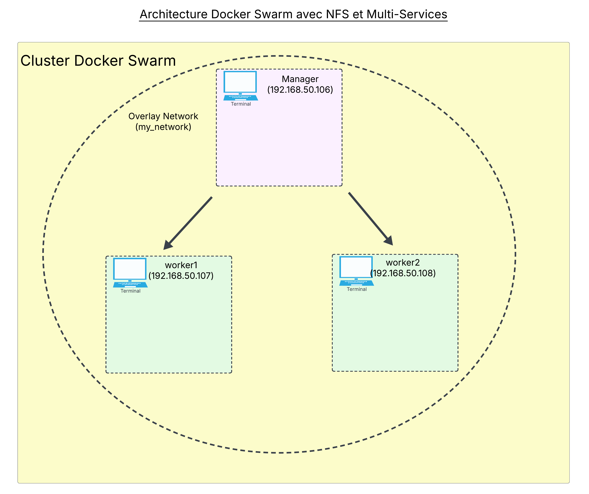
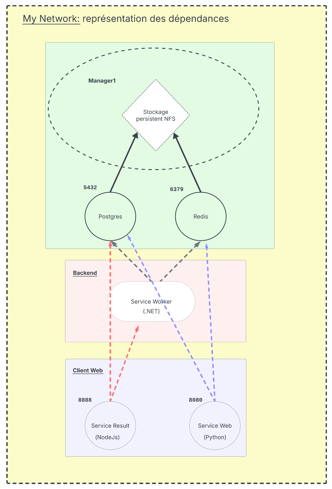

# Documentation Complète de la Solution

Ci-dessous se trouve une documentation complète qui détaille :

- Le fonctionnement global de la solution (infrastructure, déploiement, orchestration et communication entre services)
- L’explication du fichier `docker-compose.yml`
- L’explication du `Vagrantfile`
- L’explication des trois `Dockerfile`
- La procédure pour réaliser l’ensemble à la main, sans utiliser Vagrant ni Dockerfile

---

## 1. Vue d’ensemble de l’architecture

La solution se compose de plusieurs services conteneurisés orchestrés via **Docker Swarm** :

- **Services :**

  - Une application web
  - Un service Redis
  - Une base PostgreSQL
  - Un worker .NET
  - Une application de résultat Node.js

- **Infrastructure :**  
  Un cluster constitué d’un nœud **manager** et de nœuds **workers**, initialement mis en place via Vagrant pour créer des machines virtuelles.

- **Orchestration :**  
  Le manager initialise le swarm, crée un réseau overlay (`my_network`) et déploie la stack via Docker Compose.

- **Persistance :**  
  Deux volumes (pour Redis et Postgres) sont montés via NFS, permettant de conserver les données hors des containers.

- **Communication :**  
  Le réseau overlay permet aux containers répartis sur plusieurs nœuds de communiquer entre eux.

---




## 2. Explication du fichier `docker-compose.yml`

Ce fichier définit la stack Docker avec plusieurs services :

### Service **web**

- **Construction & Image :**
  - `build` : Construit l’image à partir du dossier `./vote/`.
  - `image` : L’image résultante est taguée `voting_web:latest`.
- **Ports & Volumes :**
  - Le port `8080` du container est mappé sur le port `8080` de l’hôte.
  - Le répertoire courant est monté dans `/code` (souvent utilisé en développement).
- **Dépendances :**
  - Dépend des services `redis` et `postgres`.
- **Réseau :**
  - Connecté au réseau `my_network` (overlay).
- **Déploiement :**
  - Déployé avec 2 répliques et des stratégies de mise à jour et redémarrage définies.

### Service **redis**

- **Image :**
  - Utilise l’image officielle `redis:alpine`.
- **Ports & Volumes :**
  - Expose le port `6379`.
  - Monte le volume `redis_data` (configuré pour utiliser NFS).
- **Réseau :**
  - Connecté à `my_network`.
- **Healthcheck :**
  - Vérifie la disponibilité via la commande `redis-cli ping`.

### Service **postgres**

- **Image :**
  - Utilise l’image `postgres:alpine`.
- **Ports, Variables d’environnement & Volumes :**
  - Expose le port `5432`.
  - Configure l’utilisateur, le mot de passe et la base (`postgres`).
  - Monte le volume `postgres_data`.
- **Réseau :**
  - Connecté à `my_network`.
- **Healthcheck :**
  - Utilise la commande `pg_isready -U postgres` pour vérifier la disponibilité.

### Service **worker**

- **Construction & Image :**
  - `build` : Construit l’image à partir du dossier `./worker/`.
  - `image` : Taguée `voting_worker:latest`.
- **Dépendances & Réseau :**
  - Dépend de `redis` et `postgres` et est connecté au réseau `my_network`.
- **Healthcheck :**
  - Vérifie le fonctionnement via `dotnet --version`.
- **Déploiement :**
  - Déployé en 1 réplique avec des stratégies de mise à jour et redémarrage.

### Service **result**

- **Construction & Image :**
  - `build` : Construit l’image à partir du dossier `./result/`.
  - `image` : Taguée `voting_result:latest`.
- **Ports & Volumes :**
  - Expose le port `8888` (mappé sur l’hôte).
  - Monte le dossier local `./result` dans `/app` et un volume pour `/app/node_modules`.
- **Dépendances & Réseau :**
  - Dépend de `worker` et `postgres` et est connecté au réseau `my_network`.
- **Déploiement :**
  - Déployé en 2 répliques avec mise à jour progressive et redémarrage en cas d’échec.

### Volumes et Réseau

- **Volumes :**
  - `redis_data` et `postgres_data` sont configurés avec le driver local et des options NFS pointant vers un serveur à l’adresse `192.168.50.106`.
- **Réseau :**
  - `my_network` est un réseau de type overlay, nécessaire pour permettre la communication inter-nœuds dans le cluster Swarm.

---

## 3. Explication du `Vagrantfile`

Le `Vagrantfile` permet de provisionner trois machines virtuelles (VM) destinées à former le cluster Docker Swarm :

### Nœuds Définis

- **Manager :**
  - `manager1` avec l’IP `192.168.50.106`
- **Workers :**
  - `worker1` (IP `192.168.50.107`)
  - `worker2` (IP `192.168.50.108`)

Chaque nœud utilise la box **Ubuntu 20.04**, est configuré avec **2 vCPU** et **2 Go de RAM**, et possède une IP privée.

### Provisionnement Commun

Tous les nœuds exécutent un script shell qui :

- Met à jour le fichier `/etc/hosts` pour ajouter les noms et adresses IP de tous les nœuds.
- Désactive `systemd-resolved` et configure manuellement `/etc/resolv.conf` pour utiliser des serveurs DNS publics.
- Met à jour le système et installe `curl` et `git`.
- Installe Docker via le script officiel ainsi que Docker Compose.
- Ajoute l’utilisateur `vagrant` au groupe `docker`.
- Installe le paquet `nfs-common` pour utiliser NFS.

### Provisionnement Spécifique

#### Pour le Manager (`manager1`)

- **Installation du Serveur NFS :**
  - Installe `nfs-kernel-server`, crée les dossiers `/export/redis_data` et `/export/postgres_data` et configure les exports NFS.
- **Configuration du Swarm :**
  - Clone le dépôt Git contenant le code de l’application (la branche `swarm_config` est sélectionnée).
  - Si nécessaire, quitte tout swarm existant puis initialise un nouveau swarm en utilisant l’adresse privée.
  - Crée le réseau overlay `my_network` avec une plage de sous-réseau.
  - Génère le token de jointure pour les workers et le sauvegarde dans `/vagrant/swarm_worker_token`.
  - Construit les images via `docker compose build`, corrige les tags et déploie la stack avec `docker stack deploy`.

#### Pour les Workers (`worker1` et `worker2`)

- **Jointure du Swarm :**
  - Après une courte attente, chaque worker quitte tout swarm existant, puis rejoint le swarm du manager en utilisant le token récupéré dans `/vagrant/swarm_worker_token`.

---

## 4. Explication des `Dockerfile`

### Dockerfile 1 (pour le service **result**)

```dockerfile
FROM node:17-alpine
WORKDIR /app
COPY package.json package-lock.json ./
RUN npm install
COPY . .
EXPOSE 8888
CMD ["npm", "start"]
```

- **Base :** Utilise Node.js 17 sur Alpine Linux pour un environnement léger.
- **WORKDIR :** Définit `/app` comme répertoire de travail.
- **Dépendances :** Copie les fichiers de configuration et exécute `npm install`.
- **Code :** Copie le reste du code dans l’image.
- **Port & Commande :** Expose le port `8888` et lance l’application via `npm start`.

### Dockerfile 2 (pour le service **web**)

```dockerfile
FROM python:3.11-alpine
WORKDIR /c
COPY requirements.txt requirements.txt
RUN pip install -r requirements.txt
COPY . .
EXPOSE 8080
CMD ["python", "app.py"]
```

- **Base :** Utilise Python 3.11 sur Alpine.
- **WORKDIR :** Défini sur `/c` (nom arbitraire).
- **Dépendances :** Installe les dépendances depuis `requirements.txt`.
- **Code :** Copie l’ensemble du code.
- **Port & Commande :** Expose le port `8080` et démarre l’application avec `python app.py`.

### Dockerfile 3 (pour le service **worker**)

```dockerfile
FROM mcr.microsoft.com/dotnet/sdk:7.0
WORKDIR /app
COPY *.csproj ./
RUN dotnet restore
COPY . ./
RUN dotnet publish -c Release -o out
RUN chmod +x out/Worker.dll
ENTRYPOINT ["dotnet", "out/Worker.dll"]
```

- **Base :** Utilise le SDK .NET 7.0.
- **WORKDIR :** Défini sur `/app`.
- **Dépendances & Compilation :** Copie le fichier projet, restaure les dépendances, copie le code source, puis compile et publie en Release dans le dossier `out`.
- **Permission & Lancement :** Modifie les permissions sur le fichier compilé et démarre l’application avec `dotnet out/Worker.dll`.

### D. Accès et Vérifications

**Vérifier l’état des services :**

```bash
docker stack services voting
```

_Exemple de sortie :_

```
ID             NAME              MODE         REPLICAS   IMAGE                  PORTS
d5ydk4n8soj3   voting_postgres   replicated   1/1        postgres:alpine        *:5432->5432/tcp
iwrd3ys5ajym   voting_redis      replicated   1/1        redis:alpine           *:6379->6379/tcp
ubfo3cfcg5ee   voting_result     replicated   2/2        voting_result:latest   *:8888->8888/tcp
7m7lort2szb0   voting_web        replicated   2/2        voting_web:latest      *:8080->8080/tcp
xmkjmqwockxv   voting_worker     replicated   1/1        voting_worker:latest
```

**Vérifier les containers déployés :**

```bash
docker service ls
docker service ps <NOM_DU_SERVICE>
```

**Accéder aux applications :**

- Pour le service **web**, naviguez sur `http://<IP_MANAGER>:8080`.
- Pour le service **result**, naviguez sur `http://<IP_MANAGER>:8888`.

---

## 5. Lancement et vérification de l'installation

1. **Démarrage des machines virtuelles**  
   Depuis le répertoire du projet, lancez la commande suivante :

   ```bash
   vagrant up
   ```

2. **Connexion au nœud manager**  
   Une fois l’installation terminée, connectez-vous au nœud manager :

   ```bash
   vagrant ssh manager1
   ```

3. **Vérification du cluster**  
   Sur le nœud manager, exécutez les commandes suivantes pour vérifier l’état du cluster :

   - Lister les nœuds du swarm :

     ```bash
     docker node ls
     ```

   - Vérifier la création du réseau overlay :

     ```bash
     docker network ls
     ```

   - Lister les services déployés dans la stack :

     ```bash
     docker stack services voting
     ```

   - Afficher le détail des tâches (conteneurs) pour un service :
     ```bash
     docker service ps <nom_du_service>
     ```

  - si tous les services sont sur manager1:
    ```bash
    docker container ls
    docker container kill <ID_du_conteneur>
    ```

refaite un docker ps `<NOM_DU_SERVICE>` et vous verrais qu'il se créera sur un autre noeud.
